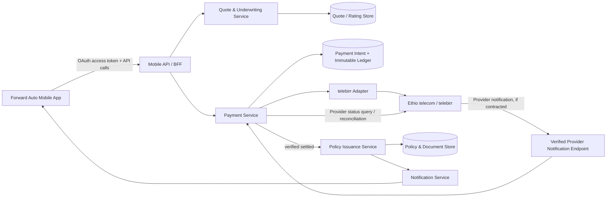

# Forward Auto — Mobile App and telebirr Payment Architecture

Forward Auto should use a **mobile app + insurance backend + payment-adapter** design. The app never contains a telebirr secret, never decides that a payment succeeded, and never issues coverage. It gathers consented quote inputs and displays state. The backend calculates the governed quote, creates a payment intent, initiates payment with telebirr, verifies the provider result, posts an immutable ledger entry, and only then asks the licensed underwriting/policy system to issue a policy.

> **Current integration boundary:** Ethio telecom’s public developer portal confirms a payment API and sandbox developer portal, and its merchant page confirms remote payments through API integration. The public pages do not disclose the merchant-specific signing, notification/callback, or status-query schema. Obtain that contract, sandbox credentials, and an approved merchant agreement before coding the provider adapter. [1] [2]

## Architecture decisions

| Layer | Recommended responsibility | Why it matters |
|---|---|---|
| **Mobile app** | React Native/TypeScript with native Keychain/Keystore storage, universal links/app links, and a secure system-browser payment handoff | Reuses the existing Forward web team’s TypeScript skills while keeping provider credentials out of the client. |
| **API/BFF** | Versioned REST APIs, app authentication, quote retrieval, payment-intent creation, and status polling | Gives mobile a stable contract and keeps payment/business rules server-side. |
| **Quote and underwriting service** | Validates insurance inputs, rate factors, NBE rate-floor rules, referral criteria, and quote expiry | The budget target remains an option-selection input, never a rate-setting input. |
| **Payment service** | Provider-neutral payment-intent state machine, telebirr adapter, idempotency, receipt normalization, and reconciliation | Allows telebirr to be added now and another approved rail later without changing the app. |
| **Policy service** | Issues a policy only after verified settlement, generates a policy document, and stores the audit trail | Prevents “paid” screens or client redirects from binding insurance cover. |
| **Ledger and reconciliation** | Immutable payment events, daily provider/settlement comparison, exception queue, and financial exports | Supports finance controls, reversals, disputes, and regulator/auditor review. |
| **Notification service** | Push/SMS/email after verified state changes; never sends success before verification | Keeps customers informed without treating an app redirect as proof of payment. |

## Reference component flow



The payment notification endpoint must be public, HTTPS-only, protected by the provider’s agreed authentication/signature scheme, and separate from ordinary mobile APIs. If telebirr confirms asynchronous notifications in the merchant contract, use them as the primary confirmation path. If it does **not**, run a controlled backend reconciliation worker that queries only outstanding intents under the provider’s documented limits; do not rely on a browser redirect or a client-side timer as payment proof.

## Mobile app structure

Use feature modules rather than one large application layer:

```text
mobile/
  app/                     # navigation, feature flags, app-link handling
  features/
    auth/                  # login, device/session controls
    quote/                 # risk-led five-step flow
    payment/               # payment handoff + pending/success/failure states
    policy/                # documents, payment history, renewal
    claims/                # claim intake and status (separate from payment)
  api/                     # generated/typed client for Forward APIs
  secure/                  # Keychain/Keystore, token refresh, device binding
  telemetry/               # privacy-safe product events, no payment secrets
```

### Mobile quote and payment UX

1. **Quote:** The customer completes Vehicle → Driver & Use → Cover → Budget Fit → Review. The app sends input to the backend and receives a quote ID, governed price range/illustration, coverage options, an expiry, and a disclosure version.
2. **Purchase intent:** On “Continue to payment,” the app asks `POST /v1/quotes/{quoteId}/payment-intents`. The backend freezes the quote version, amount, currency, expiry, and applicable rate-floor decision.
3. **Payment handoff:** The app receives an opaque payment-session payload. It opens the provider’s approved hosted flow using the OS browser or the exact telebirr mobile/mini-app mechanism specified in the signed integration guide. Do **not** embed merchant signing logic, private keys, or shared API credentials in the app.
4. **Return:** The provider may return through an app/universal link such as `https://app.forward.et/payment/return?intent=...`. Treat this as **navigation only**. Display “We’re verifying your payment,” then request `GET /v1/payment-intents/{intentId}`.
5. **Verified completion:** Only a verified provider event/status query moves the intent to `settled`; then the policy service issues coverage and returns policy/document IDs. The app may display the receipt and policy only after this server-side transition.

## Internal API contract

These are **Forward APIs**, not telebirr endpoint names. The telebirr adapter converts them to the merchant-specific contract after onboarding.

### Quote

```http
POST /v1/quotes
Idempotency-Key: <uuid>
Authorization: Bearer <customer token>

{
  "product": "motor_own_damage",
  "vehicle": {"type": "private_car", "year": 2021, "estimatedValueEtb": 850000},
  "driver": {"experienceBand": "3_to_5_years", "recentClaimsBand": "none"},
  "usage": {"primary": "private", "garagingCity": "addis_ababa"},
  "cover": {"tier": "balanced", "deductible": "standard", "addOns": ["roadside"]},
  "budgetTargetEtbMonthly": 1600,
  "consents": {"termsVersion": "2026-09-01", "quoteData": true}
}
```

```json
{
  "quoteId": "qte_01...",
  "status": "illustrative_pending_underwriting",
  "annualPremiumEtb": 19200,
  "monthlyIllustrationEtb": 1600,
  "rateFloorCheck": "passed",
  "budgetFit": "within",
  "expiresAt": "2026-09-30T06:00:00Z",
  "disclosures": ["Illustrative; live underwriting and payment verification required."]
}
```

### Payment intent

```http
POST /v1/quotes/{quoteId}/payment-intents
Idempotency-Key: <uuid>
```

```json
{
  "paymentIntentId": "pay_01...",
  "status": "created",
  "amount": {"currency": "ETB", "value": 19200},
  "expiresAt": "2026-09-30T06:10:00Z",
  "action": {
    "type": "provider_handoff",
    "url": "https://payment.forward.et/handoff/pay_01..."
  }
}
```

`payment.forward.et/handoff/...` is a short-lived Forward endpoint. It can create or render the precise telebirr request using server-held merchant credentials, then forward the customer to the provider. This keeps provider-specific payloads out of the mobile app and lets Forward rotate credentials without an app release.

### Payment state

```http
GET /v1/payment-intents/{paymentIntentId}
```

```json
{
  "paymentIntentId": "pay_01...",
  "status": "verification_pending",
  "quoteId": "qte_01...",
  "amount": {"currency": "ETB", "value": 19200},
  "policy": null,
  "nextAction": "wait_for_provider_confirmation"
}
```

Permitted final states: `settled`, `failed`, `expired`, `reversed`, `refunded`, and `disputed`. `initiated`, `pending_customer_action`, and `verification_pending` are non-final states. A policy issue endpoint must require `settled`, a matching amount/currency, a valid unexpired quote, and passing underwriting status.

## telebirr adapter contract

Build an interface that supports **direct telebirr** and a licensed Ethiopian payment gateway without altering the mobile flow:

```ts
interface PaymentProviderAdapter {
  createCustomerHandoff(input: PaymentIntent): Promise<ProviderHandoff>;
  verifyProviderNotification(rawRequest: RawRequest): Promise<VerifiedProviderEvent>;
  getPaymentStatus(providerReference: string): Promise<ProviderPaymentStatus>;
  reconcile(from: Date, to: Date): Promise<ReconciliationRecord[]>;
}
```

The direct telebirr adapter should encapsulate the exact merchant profile, request signing/encryption, timestamp/nonce generation, return URL, callback/notification verification, and transaction-status query supplied after sandbox onboarding. Persist only the provider’s transaction reference, normalized status, and the minimum verified receipt data needed for reconciliation; never persist secret material in the database or mobile telemetry.

### Provider onboarding checklist

Ethio telecom’s merchant form identifies the operational prerequisites for remote payments: registered business name, TIN, business/license documents, bank account details, and a business proposal. Remote payments may have a different merchant account from proximity payments and carry a facilitation fee. [2]

1. Establish the commercial model: direct telebirr merchant agreement or a contract with an NBE-licensed gateway operator.
2. Obtain sandbox access, merchant account/code, credentials/certificates, exact API specification, allowed return URLs, notification method, signing/test rules, transaction-status query, refund/reversal rules, settlement reports, and support/SLA contacts.
3. Register the Forward production callback URL and rotate separate development/staging/production credentials.
4. Complete sandbox tests for success, user cancellation, duplicate callback, timeout, delayed callback, amount mismatch, status-query mismatch, reversal, refund, and provider outage.
5. Complete security review, finance reconciliation dry-run, and licensed insurer approval before accepting live premium payments.

## Integration choices

| Approach | Trade-offs | Cost | Setup complexity |
|---|---|---|---|
| **Direct telebirr remote-payment integration** | Maximum control over customer flow and reconciliation; merchant-specific contract, signing, notifications, and settlement support need direct onboarding. | Merchant facilitation fees and internal build/operations cost; commercial terms must be confirmed with Ethio telecom. | Higher — requires a payment adapter, webhook/status verification, ledger, and formal merchant onboarding. |
| **NBE-licensed Ethiopian payment gateway that supports telebirr** | One adapter can support telebirr and additional rails; adds vendor dependency and may reduce control over the customer experience. Validate live telebirr support and settlement terms in the vendor contract. | Gateway commercial fees plus provider fees; obtain a written quote. | Medium — simpler provider surface but still needs the same intent, ledger, and reconciliation controls. |
| **Agent-assisted payment reference as an interim path** | Fastest way to validate demand, but gives a weaker in-app completion experience and increases manual operations. | Operational/agent cost; no automated confirmation. | Low technical complexity; suitable only for a controlled pilot, not a scaled premium-collection workflow. |

NBE’s registry lists telebirr as a commercialized payment-instrument issuer (license NPS PII/01/2021) and lists several commercialized payment-gateway operators. Use the registry to shortlist lawful partners, then confirm their current integration and settlement capability during procurement. [3]

## Security and control requirements

### Client and identity

- Use OAuth/OIDC with short-lived access tokens and refresh tokens held only in Keychain/Keystore. Do not use device storage intended for generic application data for tokens.
- Use universal links/app links, not custom URL schemes alone, for provider return routing. Bind the return to the payment intent and customer session.
- Keep payment screens on provider/Forward domains; never collect a wallet PIN, OTP, or telebirr credential in the Forward app.
- Keep personal quote data separate from optional telematics data; require explicit, granular consent for telematics and present data-use/retention information.

### Server and payments

- Store telebirr credentials in a managed secret vault; restrict access by environment and service identity; rotate on the provider’s schedule.
- Verify each notification against the provider-specified signature/certificate and timestamp window. Save the raw signed payload in a protected audit store before transforming it.
- Enforce idempotency on quote creation, payment-intent creation, callbacks, refunds, and policy issuance. Use the provider reference plus event type as an idempotency key.
- Match the immutable intent amount, ETB currency, quote ID, merchant identity, provider reference, and status before settlement. Reject partial/mismatched payments into an exception queue.
- Enforce append-only payment/audit events; separate the operational payment record from the accounting ledger.
- Apply WAF/rate limits, anti-replay protection, least-privilege service identities, encrypted backups, and a documented key/certificate-rotation runbook.

### Operations and reconciliation

NBE’s payment-system directive highlights secure interfaces, data integrity, audit logging, business continuity/disaster recovery, fraud monitoring, record retention, dispute management, and tested controls. Use those as the baseline for partner due diligence and Forward’s own payment integration design. [4]

- Run a daily reconciliation of Forward intents, provider transaction status/report, bank settlement record, and issued policies.
- Route differences to a review queue: `paid but no policy`, `policy but no paid record`, duplicate payment, reversal, refund, and timeout.
- Alert on callback failure rate, payment initiation→settlement conversion, old pending intents, amount mismatches, and provider status-query failure.
- Establish a customer support playbook for pending payment, duplicate debit, reversals/refunds, and policy-document delivery.

## Insurance-specific controls

- Rate the policy first; then run an NBE rate-floor/approved-product rule before payment initiation. NBE Directive SIB/60/2023 forbids premium charges below the applicable motor-insurance minimum rate and requires insurers to submit their own motor rate. [5]
- Freeze the quote version and premium at intent creation. Do not allow a mobile client to change cover, discount, or amount after payment creation; require a new intent after any material quote change.
- Require a licensed insurer/underwriter to own policy issuance, claims eligibility, refunds, and regulated disclosures. Forward’s demonstration app should not switch to live collection until that commercial/legal model exists.
- Treat payment data and optional behavioral data as separate processing purposes. Ethiopia’s Personal Data Protection Proclamation No. 1321/2024 is in force, so privacy notices, consent capture, access controls, retention, and incident response should be implemented before live onboarding. [6]

## Delivery sequence

1. **Weeks 1–2 — Partner decision:** choose direct telebirr vs. a licensed gateway after commercial and sandbox due diligence.
2. **Weeks 3–4 — Backend foundation:** implement quote versioning, payment intents, ledger, policy-issue gate, and provider-adapter interface with a mock provider.
3. **Weeks 5–6 — Sandbox integration:** build the telebirr adapter against supplied docs; add callback/status verification and test all failure/reversal cases.
4. **Weeks 7–8 — Mobile handoff:** implement secure app/browser handoff, universal links, pending state, receipt display, and agent fallback.
5. **Weeks 9–10 — Controls:** run penetration testing, finance reconciliation dry-run, disaster-recovery test, privacy review, and licensed-insurer/UAT approval.
6. **Pilot:** cap daily transactions, reconcile every day, observe exceptions, and expand only after settlement accuracy and support workflows are proven.

## References

[1]: https://developer.ethiotelecom.et/docs/ "Ethio telecom Developer Portal Documentation"

[2]: https://www.ethiotelecom.et/telebirr/telebirr-registration-requirements-with-registration-form/ "telebirr Merchant Registration Requirements"

[3]: https://nbe.gov.et/payment-instrument-issuers-system-operators/ "National Bank of Ethiopia Payment Instrument Issuers and System Operators"

[4]: https://nbe.gov.et/wp-content/uploads/2023/04/ONPS-02-2020.pdf "NBE Licensing and Authorization of Payment System Operators Directive"

[5]: https://nbe.gov.et/wp-content/uploads/2023/12/Directive-No.-SIB-60-2023-Motor-Insurance-Minimum-Premium-Rate.pdf "NBE Motor Insurance Minimum Premium Rate Directive SIB/60/2023"

[6]: https://justice.gov.et/en/law/personal-data-protection-proclamation/ "Ethiopia Personal Data Protection Proclamation No. 1321/2024"
